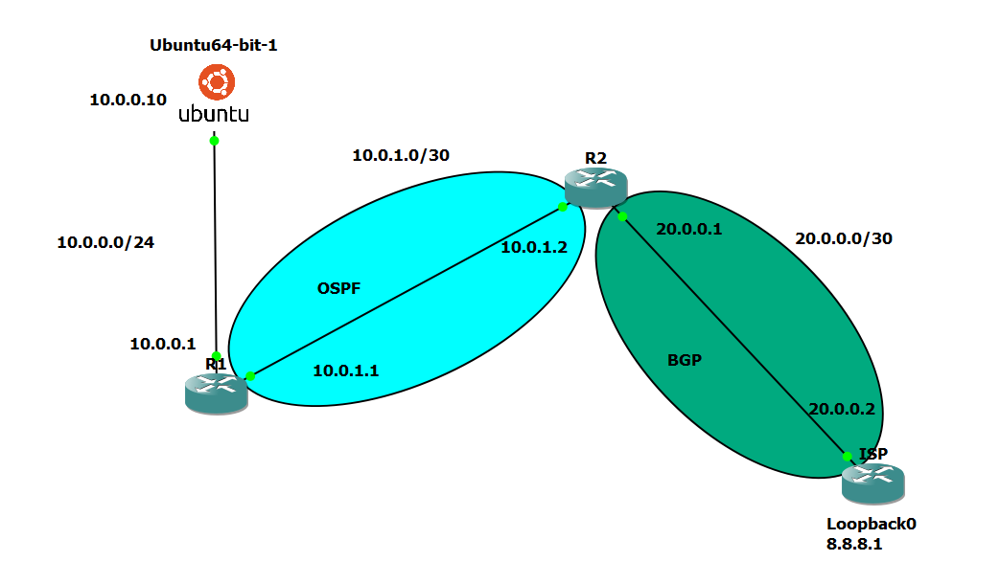
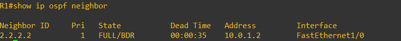
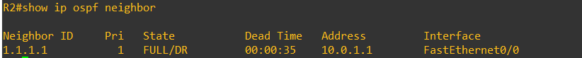
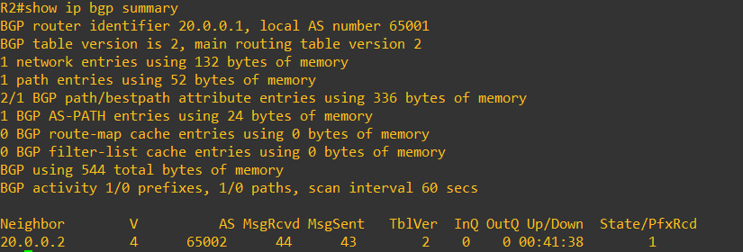
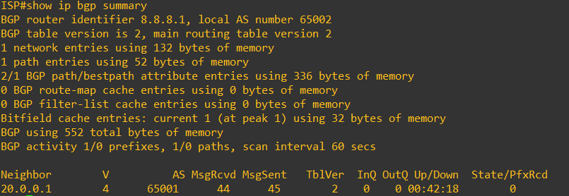
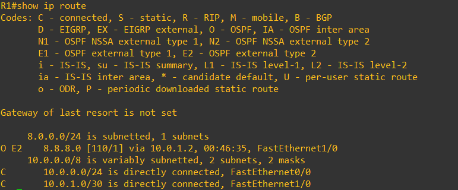
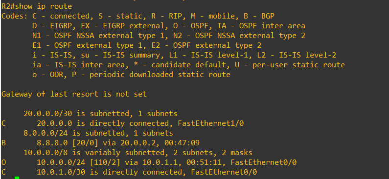
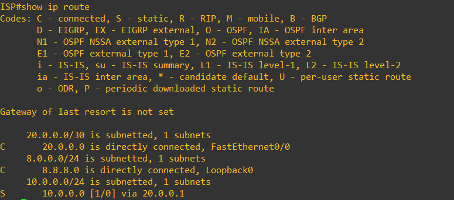
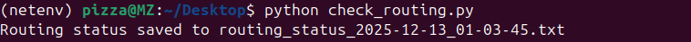

# Enterprise Network Routing & Automation (GNS3)


## ✨ Executive Summary

This project showcases the design, implementation, troubleshooting, and automation of a small **enterprise network** using **GNS3**. The project focuses on *correct routing behavior* rather than topology size, demonstrating how internal and external routing protocols work together to provide reliable end-to-end connectivity.

Internal communication is handled using **OSPF**, while **eBGP** is used at the network edge to simulate connectivity to an external Internet Service Provider (ISP). A **Linux (Ubuntu) host** is used for validation, troubleshooting, and Python-based automation.

---

## 🎯 Project Goals

* Build a clear enterprise routing topology with **core, edge, and ISP separation**
* Implement **OSPF** for internal dynamic routing
* Implement **eBGP** to simulate external internet connectivity
* Validate packet forwarding using Linux networking tools
* Automate routing verification using **Python (Netmiko)**

---

## 🧱 Network Architecture

### Logical Topology

Ubuntu Host  →  R1 (Core Router)  →  R2 (Edge Router)  →  ISP Router

### Device Roles

* **R1 – Core Router**
  Acts as the internal gateway for the enterprise network

* **R2 – Edge Router**
  Connects the enterprise network to the external ISP using BGP

* **ISP Router**
  Represents an external autonomous system advertising a public network

* **Ubuntu Host**
  Used for traffic testing, troubleshooting, and automation



---

## 🌐 IP Addressing Overview

| Link                               | Network      |
| ---------------------------------- | ------------ |
| Ubuntu ↔ R1                        | 10.0.0.0 /24 |
| R1 ↔ R2                            | 10.0.1.0 /30 |
| R2 ↔ ISP                           | 20.0.0.0 /30 |
| ISP Loopback (Internet Simulation) | 8.8.8.0 /24  |

---

## 🔁 Routing Design

### Internal Routing – OSPF

* OSPF Area 0 is deployed between R1 and R2
* Provides automatic internal route exchange
* Ensures fast convergence and scalability





---

### External Routing – BGP

* eBGP peering between:

  * **R2: AS 65001**
  * **ISP: AS 65002**
* ISP advertises a simulated public prefix (`8.8.8.0/24`)
* BGP routes are redistributed into OSPF to allow internal reachability





---

## 🧪 Validation & Testing

### Connectivity Validation

Testing was performed from the Ubuntu host using:
* `ping`

End-to-end connectivity to the simulated internet address (`8.8.8.1`) confirms correct packet forwarding across all routing domains.


---

### Routing Verification

Routing state was validated using:

* `show ip route`
* `show ip ospf neighbor`
* `show ip bgp summary`

These commands confirm correct route learning and protocol operation.





---

## 🐧 Linux & Python Automation

To reduce manual verification, a Python automation script was developed using **Netmiko**. The script connects to routers over SSH and automatically collects routing and protocol state.

This approach improves repeatability and reflects real operational practices.

[📁 Script Location](automation/check_routing.py)



[📁 OUTPUT](output/routing_status_2025-12-13_00-18-21.txt)

---


## 📂 Repository Structure

```
network-routing-automation/
├── gns3/
│   └── topology.gns3
├── configs/
│   ├── R1.conf
│   ├── R2.conf
│   └── ISP.conf
├── automation/
│   └── check_routing.py
├── outputs/
│   └── routing_status_*.txt
└── README.md
```

